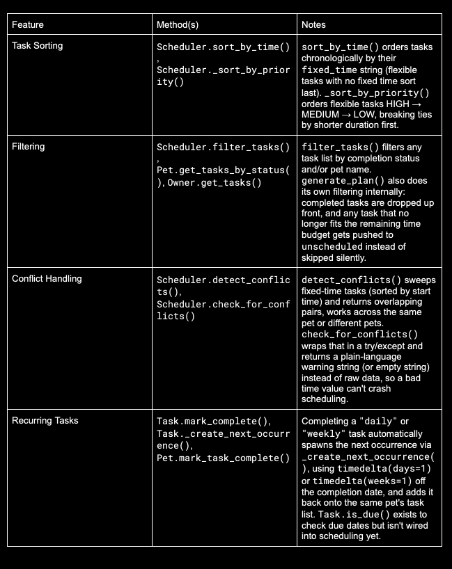

# PawPal+ (Module 2 Project)

You are building **PawPal+**, a Streamlit app that helps a pet owner plan care tasks for their pet.

## Scenario

A busy pet owner needs help staying consistent with pet care. They want an assistant that can:

- Track pet care tasks (walks, feeding, meds, enrichment, grooming, etc.)
- Consider constraints (time available, priority, owner preferences)
- Produce a daily plan and explain why it chose that plan

Your job is to design the system first (UML), then implement the logic in Python, then connect it to the Streamlit UI.

## What you will build

Your final app should:

- Let a user enter basic owner + pet info
- Let a user add/edit tasks (duration + priority at minimum)
- Generate a daily schedule/plan based on constraints and priorities
- Display the plan clearly (and ideally explain the reasoning)
- Include tests for the most important scheduling behaviors

## Getting started

### Setup

```bash
python -m venv .venv
source .venv/bin/activate  # Windows: .venv\Scripts\activate
pip install -r requirements.txt
```

### Suggested workflow

1. Read the scenario carefully and identify requirements and edge cases.
2. Draft a UML diagram (classes, attributes, methods, relationships).
3. Convert UML into Python class stubs (no logic yet).
4. Implement scheduling logic in small increments.
5. Add tests to verify key behaviors.
6. Connect your logic to the Streamlit UI in `app.py`.
7. Refine UML so it matches what you actually built.

## 🖥️ Sample Output

Paste a sample of your app's CLI or Streamlit output here so a reader can see what a generated plan looks like:

```
=== Today's Schedule for Mochi (dog) ===
Total minutes used: 40 / 45

08:00 AM - 08:05 AM | Give meds
08:05 AM - 08:25 AM | Morning walk
08:25 AM - 08:40 AM | Play fetch

Scheduled tasks (in order):

- 08:00 AM - 08:05 AM: Give meds (5 min), included because it's high priority and fixed-time commitment.
- 08:05 AM - 08:25 AM: Morning walk (20 min), included because it's high priority.
- 08:25 AM - 08:40 AM: Play fetch (15 min), included because it's medium priority.

=== Today's Schedule for Luna (cat) ===
Total minutes used: 30 / 45

08:00 AM - 08:05 AM | Feed breakfast
08:05 AM - 08:20 AM | Laser pointer playtime
08:20 AM - 08:30 AM | Brush fur

Scheduled tasks (in order):

- 08:00 AM - 08:05 AM: Feed breakfast (5 min), included because it's high priority and fixed-time commitment.
- 08:05 AM - 08:20 AM: Laser pointer playtime (15 min), included because it's medium priority.
- 08:20 AM - 08:30 AM: Brush fur (10 min), included because it's low priority.
```

```
# e.g.:
# Daily plan for Biscuit (Golden Retriever):
#   08:00 — Morning walk (30 min) [priority: high]
#   09:00 — Feeding (10 min) [priority: high]
#   ...
```

## 🧪 Testing PawPal+

**Description of tests:** This suite has thirteen tests covering five areas: basic task/pet mechanics (marking complete, adding tasks), sorting (chronological order, flexible tasks sorting last), recurring tasks (daily/weekly spawning the correct next due date, one-off tasks not duplicating, and recurrence working even without a pet attached), conflict detection (flagging same-time tasks, correctly ignoring back-to-back tasks, and returning a clean empty string when nothing overlaps), and scheduling edge cases (empty task lists and tasks too long to fit the time budget, both handled gracefully instead of crashing).

```bash
# Run the full test suite:
pytest

# Run with coverage:
pytest --cov
```

**Sample pytest output:**

```text
collected 13 items

tests/test_pawpal.py::test_task_completion PASSED                               [  7%]
tests/test_pawpal.py::test_task_addition_increases_pet_task_count PASSED        [ 15%]
tests/test_pawpal.py::test_daily_task_spawns_next_occurrence_due_tomorrow PASSED [ 23%]
tests/test_pawpal.py::test_non_recurring_task_does_not_spawn_next_occurrence PASSED [ 30%]
tests/test_pawpal.py::test_weekly_task_spawns_next_occurrence_due_in_seven_days PASSED [ 38%]
tests/test_pawpal.py::test_recurring_task_without_a_pet_does_not_crash PASSED   [ 46%]
tests/test_pawpal.py::test_sort_by_time_returns_chronological_order PASSED      [ 53%]
tests/test_pawpal.py::test_sort_by_time_puts_flexible_tasks_last PASSED         [ 61%]
tests/test_pawpal.py::test_detect_conflicts_flags_duplicate_times PASSED        [ 69%]
tests/test_pawpal.py::test_detect_conflicts_ignores_back_to_back_tasks PASSED   [ 76%]
tests/test_pawpal.py::test_check_for_conflicts_returns_empty_string_when_no_conflicts PASSED [ 84%]
tests/test_pawpal.py::test_generate_plan_with_no_tasks_does_not_crash PASSED    [ 92%]
tests/test_pawpal.py::test_generate_plan_skips_task_that_does_not_fit_budget PASSED [100%]

================================= 13 passed in 0.02s =================================
```

**Confidence level:** I would rate my confidence to be 4/5. The tests are specific and deterministic rather than vague, and they cover the riskiest logic well: recurrence date math, conflict boundary conditions, and sorting, along with solid edge cases like empty task lists and missing pet references. It falls short of 5 because there's no full integration test exercising `generate_plan()` end-to-end with a realistic mix of tasks, and a few methods (`filter_tasks()`, `Owner.get_tasks()`, `Pet.mark_task_complete()`) have no dedicated test coverage yet.

## 📐 Smarter Scheduling

> Fill in once you've implemented scheduling logic.

| Feature           | Method(s) | Notes                             |
| ----------------- | --------- | --------------------------------- |
| Task sorting      |           | e.g., by priority, duration       |
| Filtering         |           | e.g., skip tasks if time runs out |
| Conflict handling |           | e.g., overlapping time slots      |
| Recurring tasks   |           | e.g., daily vs. weekly            |

I'm going to fill in the table by creating a new table:


## 📸 Features

PawPal+ Features

Task Scheduling

Priority-based scheduling — Flexible tasks (no fixed clock time) are ordered HIGH → MEDIUM → LOW priority, with shorter tasks scheduled first as a tiebreaker within the same priority level.
(Scheduler.\_sort_by_priority(), pawpal_system.py)
Fixed-time anchoring — Tasks marked is_flexible=False (e.g. medication, vet appointments) are scheduled at their exact fixed_time, rather than wherever the scheduler's internal clock happens to be.
(Scheduler.generate_plan(), pawpal_system.py)
Time-budget enforcement — Tasks are added greedily until the available time for the day runs out. Anything that doesn't fit is reported as "unscheduled" instead of being silently dropped or crashing the scheduler.
(Scheduler.\_fits_in_remaining_time(), generate_plan())
Plain-language plan explanations — Every generated schedule comes with a human-readable explanation of why each task was included, skipped, or flagged as conflicting.
(Scheduler.explain_plan())

Sorting

Sort by time — Tasks can be sorted chronologically by their fixed time, with tasks that have no fixed time placed at the end. Used both internally by the scheduler and to display an owner's task list in time order in the UI.
(Scheduler.sort_by_time(), used in app.py's task list display and main.py's demo)

Filtering

Filter by completion status and/or pet — Tasks can be filtered to show just what's pending, just what's completed, just one pet's tasks, or any combination, useful for owners managing more than one pet.
(Scheduler.filter_tasks(), Pet.get_tasks_by_status(), Owner.get_tasks())

Conflict Detection

Overlap detection (same pet or across pets) — Detects when two fixed-time tasks' windows overlap, whether they belong to the same pet or two different pets under the same owner. Uses a sorted sweep rather than comparing every possible pair, so it scales better as the task list grows.
(Scheduler.detect_conflicts())
Non-crashing conflict warnings — A lightweight wrapper returns a plain-language warning string (or an empty string if there's nothing to report) instead of raising an exception, so malformed task data can't take down the scheduling flow.
(Scheduler.check_for_conflicts())
Real-time conflict warnings in the UI — Conflicts are surfaced immediately in the task list, before the owner even generates a schedule, and are shown again (more prominently, via st.error) if they generate a schedule anyway.
(app.py, Step 3 and Step 4 sections)

Recurring Tasks

Daily and weekly recurrence — Completing a task marked "daily" or "weekly" automatically creates the next occurrence, due exactly one day or seven days later (calculated with timedelta), and adds it back onto the same pet's task list.
(Task.mark_complete(), Task.\_create_next_occurrence())
Due-date awareness — Recurring tasks track a due_date, and Task.is_due() can check whether that date has arrived. (Note: this isn't yet wired into generate_plan() — a task due tomorrow will still appear in today's schedule. Flagging this as a known gap rather than a finished feature.)

## 📸 Demo Walkthrough

Describe your app in numbered steps so a reader can follow along without watching a video:

1. Launch the app with `streamlit run app.py`. You'll see the PawPal+ title and a prompt to create an owner.
2. Enter an owner name (e.g. "Jordan") and click **Create Owner**. This creates an `Owner` object that persists in `st.session_state` for the rest of the session.
3. Optionally expand **Owner preferences** to save a preference like `preferred_walk_time: morning`. (Note: preferences are stored and viewable, but not yet used by the scheduler itself.)
4. Add a pet by entering a name and species, then click **Add Pet**. The pet appears in a dropdown selector, and you can add multiple pets, each with their own separate task list.
5. With a pet selected, add a task using the form: give it a title, duration, and priority. Check "Flexible timing" for tasks that can happen whenever (like play or grooming), or uncheck it for tasks tied to an exact clock time (like meds), which reveals a **Fixed time (HH:MM)** field to enter that. Also choose whether it repeats daily, weekly, or not at all. If the fixed time is entered in the wrong format, the app shows an error and won't add the task until it's corrected.
6. Set your available minutes for the day and a start time (24-hour HH:MM format), then click **Generate schedule**. If the start time is malformed, the app shows a friendly error instead of crashing. Otherwise, PawPal+ builds a time-slotted schedule: fixed-time tasks are anchored to their exact time, flexible tasks fill in by priority, and anything that doesn't fit is listed separately as unscheduled.
7. Click **Complete** next to any task to mark it done. If it's a recurring task, PawPal+ automatically creates its next occurrence (due the next day or the next week) and adds it back to the list.
8. Set your available minutes for the day and a start time, then click **Generate schedule**. PawPal+ builds a time-slotted schedule: fixed-time tasks are anchored to their exact time, flexible tasks fill in by priority, and anything that doesn't fit is listed separately as unscheduled.
9. Expand **Why this schedule?** to see a plain-language explanation of why each task was included, skipped, or flagged as conflicting.
10. Repeat steps 5–9 for additional pets by switching the pet selector, each pet's tasks and schedule are tracked independently under the same owner.

**Screenshot or video** _(optional)_: <!-- Insert a screenshot or link to a demo video here -->

DEMO of CLI Output:

```text
$ python3 main.py

=== Mochi's tasks sorted by time (were added out of order) ===
            08:00  |  Give meds
            12:30  |  Midday check-in
            18:00  |  Evening walk
    no fixed time  |  Play fetch

=== Filtering demo ===
Mochi's pending tasks: ['Evening walk', 'Play fetch', 'Midday check-in']
Mochi's completed tasks: ['Give meds']
Luna's tasks (filtered out of a combined list): ['Feed dinner', 'Feed breakfast', 'Laser pointer playtime']

=== Recurring task demo ===
Mochi's task count before completing 'Daily medication': 5
'Daily medication' due date: 2026-07-08
Mochi's task count after completing 'Daily medication': 6
Original task completed: True
New task auto-created: 'Daily medication', due 2026-07-09, completed=False

'Grooming' (weekly) completed. Next occurrence due: 2026-07-15

=== Conflict detection demo ===
Checking Mochi's own tasks for conflicts:
⚠️ Scheduling conflicts detected:
  - Mochi: 'Daily medication' (09:00) overlaps with 'Daily medication' (09:00).
  - Mochi: 'Nail trim' (10:00) overlaps with 'Training session' (10:00).

Checking ALL of Jordan's tasks (both pets combined) for conflicts:
⚠️ Scheduling conflicts detected:
  - Mochi: 'Daily medication' (09:00) overlaps with 'Daily medication' (09:00).
  - Mochi: 'Nail trim' (10:00) overlaps with 'Training session' (10:00).
  - 'Vet drop-off' for Mochi (15:00) overlaps with 'Vet pickup' for Luna (15:00).

=== Today's Schedule for Mochi (dog) ===
Total minutes used: 45 / 45

  09:00 AM - 09:05 AM  |  Daily medication
  10:00 AM - 10:15 AM  |  Nail trim
  10:15 AM - 10:35 AM  |  Training session
  12:30 PM - 12:35 PM  |  Midday check-in

  Could not fit today:
    - Vet drop-off (10 min)
    - Evening walk (20 min)
    - Play fetch (15 min)

Scheduling conflicts detected:
  - 'Nail trim' (10:00) overlaps with 'Training session' (10:00). Consider adjusting one of these times.

Scheduled tasks (in order):
  - 09:00 AM - 09:05 AM: Daily medication (5 min), included because it's high priority and fixed-time commitment.
  - 10:00 AM - 10:15 AM: Nail trim (15 min), included because it's low priority and fixed-time commitment.
  - 10:15 AM - 10:35 AM: Training session (20 min), included because it's medium priority and fixed-time commitment.
  - 12:30 PM - 12:35 PM: Midday check-in (5 min), included because it's low priority and fixed-time commitment.
Unscheduled tasks:
  - Vet drop-off (10 min): skipped because there wasn't enough remaining time after higher-priority or fixed-time tasks were placed.
  - Evening walk (20 min): skipped because there wasn't enough remaining time after higher-priority or fixed-time tasks were placed.
  - Play fetch (15 min): skipped because there wasn't enough remaining time after higher-priority or fixed-time tasks were placed.

=== Today's Schedule for Luna (cat) ===
Total minutes used: 35 / 45

  08:00 AM - 08:05 AM  |  Feed breakfast
  03:00 PM - 03:10 PM  |  Vet pickup
  07:00 PM - 07:05 PM  |  Feed dinner
  07:05 PM - 07:20 PM  |  Laser pointer playtime

  Could not fit today:
    - Grooming (30 min)

Scheduled tasks (in order):
  - 08:00 AM - 08:05 AM: Feed breakfast (5 min), included because it's high priority and fixed-time commitment.
  - 03:00 PM - 03:10 PM: Vet pickup (10 min), included because it's high priority and fixed-time commitment.
  - 07:00 PM - 07:05 PM: Feed dinner (5 min), included because it's high priority and fixed-time commitment.
  - 07:05 PM - 07:20 PM: Laser pointer playtime (15 min), included because it's medium priority.
Unscheduled tasks:
  - Grooming (30 min): skipped because there wasn't enough remaining time after higher-priority or fixed-time tasks were placed.
```

Final UML Diagram:

